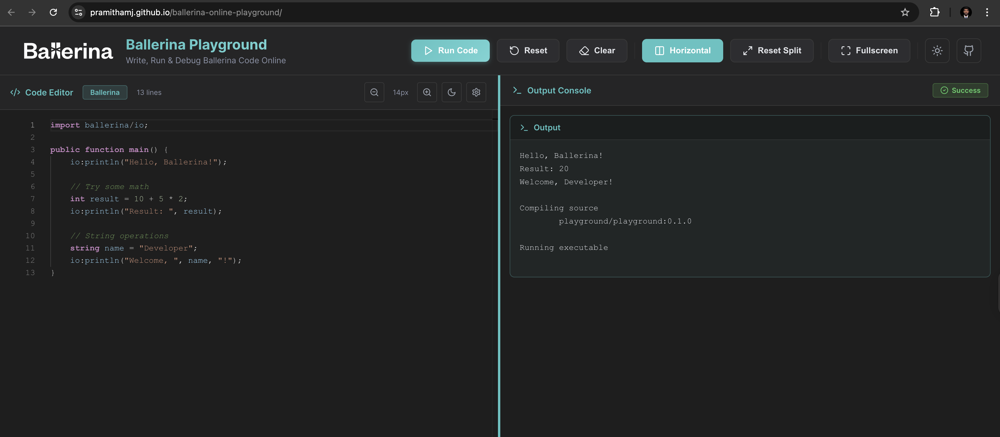

[](https://github.com/PramithaMJ/ballerina-online-playground/actions/workflows/deploy-github-pages.yml)

# Ballerina Online Playground

A web-based interactive playground for writing and executing Ballerina code in real-time.

## Architecture

```
┌─────────────┐      HTTP POST      ┌──────────────┐      Docker API     ┌─────────────────-┐
│   Frontend  │ ─────────────────►  │   Go Backend │ ──────────────────► │  Ballerina       │
│  (HTML/JS)  │                     │   (Port 8081)│                     │  Docker Container│
└─────────────┘ ◄─────────────────  └──────────────┘ ◄────────────────── └────────────────-─┘
                   JSON Response                         Execution Output
```

## Features

- ✅ Real-time Ballerina code execution
- ✅ Secure Docker-based sandboxed environment
- ✅ Resource limits (CPU, Memory, Network)
- ✅ Execution timeout protection (30s)
- ✅ Clean, modern UI
- ✅ Error handling and feedback

## **Modern web browser** (for frontend)




## API Endpoints

### POST `/execute` or `/run`

Execute Ballerina code

**Request:**

```json
{
  "code": "import ballerina/io;\n\npublic function main() {\n    io:println(\"Hello!\");\n}"
}
```

**Response:**

```json
{
  "output": "Hello!\n",
  "error": ""
}
```

### POST `/compile`

Compile Ballerina code (without execution)

Same request/response format as `/execute`

## Security Features

1. **Network Isolation**: Containers run with `--network none`
2. **Resource Limits**:
   - Memory: 256MB max
   - CPU: 0.5 core max
   - Process limit: 50
3. **Execution Timeout**: 30 seconds max
4. **Read-only Filesystem**: Code mounted as read-only
5. **Temporary File Cleanup**: Auto-cleanup after execution

## Testing

Test the backend API directly:

```bash
curl -X POST http://localhost:8081/execute \
  -H "Content-Type: application/json" \
  -d '{"code":"import ballerina/io;\n\npublic function main() {\n    io:println(\"Hello, World!\");\n}"}'
```

## Project Structure

```
ballerina-online-playground/
├── backend/
│   ├── main.go              # Entry point, HTTP server setup
│   ├── handler/
│   │   ├── run.go          # Code execution handler
│   │   └── compile.go      # Code compilation handler
│   ├── utils/
│   │   ├── docker.go       # Docker execution utilities
│   │   └── file.go         # File handling utilities
│   ├── Dockerfile
│   ├── docker-compose.yml
│   └── go.mod
└── frontend/
    ├── index.html          # Main UI
    ├── script.js           # Frontend logic
    └── style.css           # Styling
```

## Usage

1. **Write Code**: Enter your Ballerina code in the left panel
2. **Run Code**: Click the "Run" button
3. **View Output**: See the execution result in the right panel
4. **Clear**: Use the "Clear" button to reset
