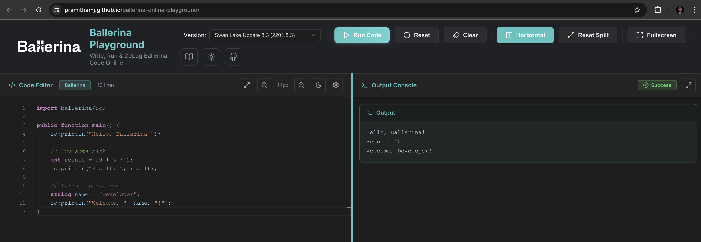
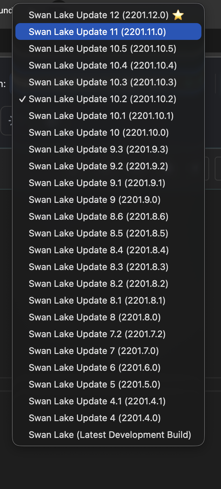
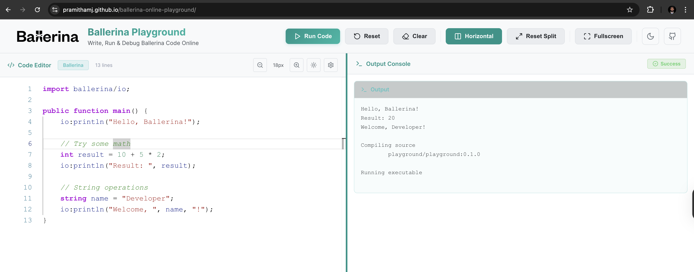
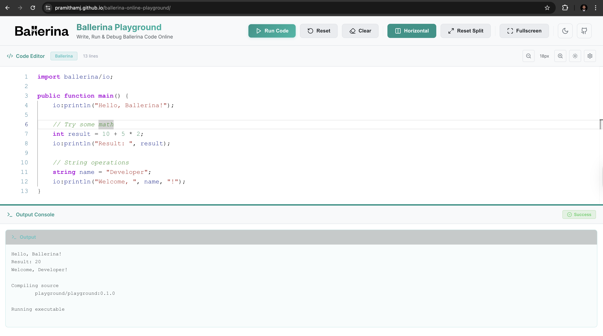
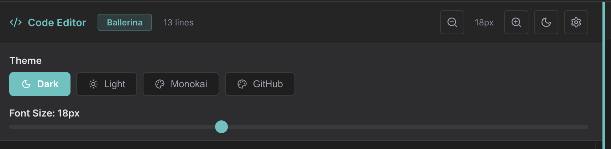

[](https://github.com/PramithaMJ/ballerina-online-playground/actions/workflows/deploy-github-pages.yml)

# 🎯 Ballerina Online Playground

A powerful, secure, and high-performance web-based IDE for writing, compiling, and executing Ballerina code in real-time. Built with modern web technologies and optimized for developer experience.

**🌐 [Try it now: [https://ballerina-online-playground.pages.dev/](https://ballerina-online-playground.pages.dev/)**

Ballerina Lint Tool : [https://pramithamj.github.io/ballerina-lint/](https://pramithamj.github.io/ballerina-lint/)

## ✨ Features

### Core Features

- **Real-time Code Execution**: Write and run Ballerina code instantly in your browser
- **26 Ballerina Versions**: Support for versions from 2201.3.0 to 2201.12.0
- **Monaco Editor Integration**: Professional code editor with syntax highlighting, auto-completion, and IntelliSense
- **Docker-based Isolation**: Secure sandboxed execution environment for each code run
- **Container Pooling**: Pre-warmed containers for instant execution and superior performance
- **Multiple Themes**: Choose from various Monaco editor themes for comfortable coding

### User Interface

- **Split-Panel Layout**: Resizable editor and output panels
- **Fullscreen Mode**: Maximize editor or output for focused work
- **Dark/Light Themes**: Customizable appearance
- **Version Selector**: Easy switching between Ballerina versions
- **Status Indicators**: Real-time execution status and progress
- **Error Notifications**: Clear, actionable error messages

### Security Features

- **Rate Limiting**: 5 requests per 5 seconds per client
- **Code Validation**: Pre-execution security checks and sanitization
- **Network Isolation**: Containers run with `--network none`
- **Resource Limits**:
  - Memory: 256MB per execution
  - CPU: 0.5 cores per execution
  - Process: 50 concurrent processes max
- **Execution Timeout**: 60-second hard limit
- **Read-only Filesystem**: Containers use read-only root filesystem

### Performance Optimizations

- **High-Performance Container Pool**: Pre-initialized containers for instant execution
- **Smart Version Allocation**: More containers for popular versions
- **Container Warming**: Pre-compiled runtime in each container
- **Offline Mode**: No external dependencies during execution
- **Efficient File Operations**: Optimized package structure and file copying

## 🏗️ System Architecture

### Overview Diagram

```
┌──────────────────────────────────────────────────────────────────────┐
│                        User's Browser                                │
│                                                                      │
│  ┌────────────────────────────────────────────────────────────────┐  │
│  │          React + Vite Frontend (Static Site)                   │  │
│  │  • Monaco Editor  • Version Selector  • Output Panel           │  │
│  └────────────────────────────┬───────────────────────────────────┘  │
└───────────────────────────────┼──────────────────────────────────────┘
                                │ HTTPS/WebSocket
                                │
┌───────────────────────────────┼──────────────────────────────────────┐
│                               ▼                                      │
│  ┌────────────────────────────────────────────────────────────────┐  │
│  │           Cloudflare Tunnel (Optional)                         │  │
│  │  • TLS Termination  • DDoS Protection  • CDN                   │  │
│  └────────────────────────────┬───────────────────────────────────┘  │
└───────────────────────────────┼──────────────────────────────────────┘
                                │
┌───────────────────────────────┼──────────────────────────────────────┐
│                               ▼                                      │
│  ┌────────────────────────────────────────────────────────────────┐  │
│  │              Go Backend Server (Port 8081)                     │  │
│  │                                                                │  │
│  │  ┌──────────────────────────────────────────────────────────┐  │  │
│  │  │  Middleware: CORS, Rate Limiting, Validation             │  │  │
│  │  └──────────────────────────────────────────────────────────┘  │  │
│  │  ┌──────────────────────────────────────────────────────────┐  │  │
│  │  │  Handlers: /run, /compile                                │  │  │
│  │  └──────────────────────────────────────────────────────────┘  │  │
│  │  ┌──────────────────────────────────────────────────────────┐  │  │
│  │  │  Container Pool Manager (62 Pre-warmed Containers)       │  │  │
│  │  └──────────────────────────────────────────────────────────┘  │  │
│  └────────────────────────────┬───────────────────────────────────┘  │
└───────────────────────────────┼──────────────────────────────────────┘
                                │ Docker API
┌───────────────────────────────┼──────────────────────────────────────┐
│                               ▼                                      │
│  ┌────────────────────────────────────────────────────────────────┐  │
│  │                    Docker Engine                               │  │
│  │                                                                │  │
│  │  ┌──────────┐  ┌──────────┐  ┌──────────┐  ┌──────────┐        │  │
│  │  │ Container│  │ Container│  │ Container│  │   ...    │        │  │
│  │  │ 2201.12.0│  │ 2201.11.0│  │ 2201.10.5│  │          │        │  │
│  │  └──────────┘  └──────────┘  └──────────┘  └──────────┘        │  │
│  │                                                                │  │
│  │  • Network: Disabled        • Memory: 256MB                    │  │
│  │  • CPU: 0.5 cores          • Timeout: 60s                      │  │
│  └────────────────────────────────────────────────────────────────┘  │
└──────────────────────────────────────────────────────────────────────┘
```

### Request Flow

```
1. User writes code and clicks "Run"
   ↓
2. Frontend validates code locally
   ↓
3. POST /run {code, version} → Backend
   ↓
4. Rate limiting check
   ↓
5. Backend validates and sanitizes code
   ↓
6. Create Ballerina package structure:
   • Ballerina.toml (project config)
   • main.bal (user code)
   ↓
7. Get pre-warmed container from pool
   ↓
8. Mount code directory into container
   ↓
9. Execute: bal run --offline main.bal
   ↓
10. Capture stdout/stderr (60s timeout)
   ↓
11. Return container to pool
   ↓
12. Send response {output, error} to frontend
   ↓
13. Display results in output panel
```

## 🛠️ Technology Stack

### Frontend

- **Framework**: React 18 with Vite
- **Editor**: Monaco Editor (VS Code engine)
- **UI**: Custom CSS with responsive design
- **State Management**: React Hooks
- **HTTP Client**: Fetch API
- **Build Tool**: Vite 4.x

### Backend

- **Language**: Go 1.23
- **Web Framework**: Go standard library (`net/http`)
- **Container Runtime**: Docker Engine API
- **Build Tool**: Go modules

### Infrastructure

- **Containerization**: Docker & Docker Compose
- **Reverse Proxy**: Nginx (optional)
- **Tunneling**: Cloudflare Tunnel (optional)
- **Orchestration**: Docker Compose

## 📋 Prerequisites

- **Docker**: Version 20.10+ with Docker Engine API access
- **Go**: Version 1.23+ (for backend development)
- **Node.js**: Version 18+ and npm/yarn (for frontend development)
- **4GB+ RAM**: Required for running container pools efficiently

```####

```bash
cd frontend-vite

# Install dependencies
npm install

# Configure API endpoint
echo "VITE_API_URL=http://localhost:8081" > .env

# Start development server
npm run dev
```

The frontend will be available at `http://localhost:5173`

## 📦 Supported Ballerina Versions

The playground supports 26 Ballerina versions:

- **Latest**: 2201.12.0
- **Recent**: 2201.11.0, 2201.10.x
- **Stable**: 2201.9.x, 2201.8.x
- **Legacy**: 2201.7.x to 2201.3.0

Container allocation is optimized based on version popularity and usage patterns.

## 🔐 Security Considerations

### Input Validation

- Maximum code size: 50KB
- Maximum lines: 1,000
- Forbidden imports detection
- Infinite loop detection

### Container Security

- Containers run with non-root user (uid: 10014)
- No network access (`--network none`)
- Read-only root filesystem
- Resource limits strictly enforced
- Isolated from host filesystem
- Automatic cleanup after execution

### Rate Limiting

- 5 requests per 5 seconds per IP address
- Prevents abuse and ensures fair usage
- Configurable limits

## 🤝 Contributing

Contributions are welcome! Please follow these steps:

1. Fork the repository
2. Create a feature branch: `git checkout -b feature/amazing-feature`
3. Commit your changes: `git commit -m 'Add amazing feature'`
4. Push to the branch: `git push origin feature/amazing-feature`
5. Open a Pull Request

## 📝 License

This project is licensed under the MIT License - see the [LICENSE](LICENSE) file for details.

## 👥Authors

- **Pramitha Jayasooriya** - [@PramithaMJ](https://github.com/PramithaMJ)

## Acknowledgments

- [Ballerina](https://ballerina.io/) - The Ballerina programming language
- [Monaco Editor](https://microsoft.github.io/monaco-editor/) - Code editor from VS Code
- [React](https://react.dev/) - JavaScript library for building user interfaces
- [Go](https://go.dev/) - The Go programming language
- [Docker](https://www.docker.com/) - Container platform

## 📸 Screenshots

### Main Interface



### Version Selector



### Code Execution



### Output Panel



### Settings



## 🔗 Links

- **Live App**: [https://ballerina-online-playground.pages.dev/](https://ballerina-online-playground.pages.dev/)
- **Ballerina Lint Tool**: [https://pramithamj.github.io/ballerina-lint/](https://pramithamj.github.io/ballerina-lint/)
- **Documentation**: [docs/](docs/)
- **Issue Tracker**: [GitHub Issues](https://github.com/PramithaMJ/ballerina-online-playground/issues)
- **Ballerina Documentation**: https://ballerina.io/learn/
